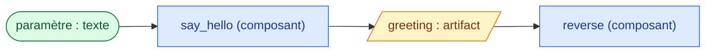
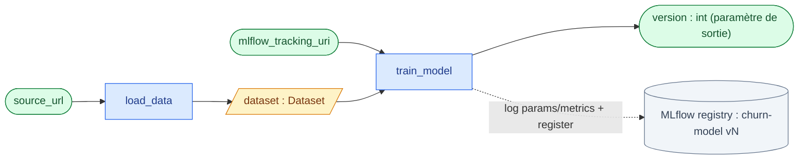
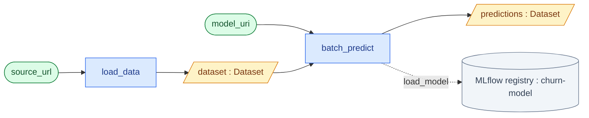

# Introduction — automatiser l'enchaînement des étapes ML

Aux modules précédents, on a appris à rendre un entraînement reproductible (module repro) puis à servir un modèle (module serving). Mais entre les deux, tout l'enchaînement reste manuel : on lance le script d'entraînement à la main, on regarde la métrique, on décide de promouvoir, on déclenche un scoring batc etc. Chaque étape est une commande tapée dans un terminal, dans le bon ordre, sur la bonne machine.

Un workflow ML, n'est pas juste un script isolé : c'est une **suite d'étapes** (charger les données → entraîner → évaluer → promouvoir → scorer → surveiller) qu'on veut rejouer à l'identique, planifier, tracer et faire tourner ailleurs que sur sa machine. **Orchestrer**, c'est décrire cet enchaînement comme un objet versionné et exécutable, plutôt que comme une suite de gestes manuels.

On construit ça avec **Kubeflow Pipelines (KFP)**, l'orchestrateur ML de la platforme Kubeflow, en montant progressivement :

1. **Comprendre KFP** : les composants (component, pipeline, client), installer le cluster, valider avec un hello world.
2. **Pipeline d'entraînement** : transformer le script d'entraînement en pipeline qui charge, entraîne et enregistre une version au registry.
3. **Pipeline d'inférence (batch)** : scorer un dataset avec le modèle enregistré.
4. **Déploiement automatique** : fermer la boucle : entraîner, puis promouvoir le modèle uniquement s'il bat le champion en place.

# 1 - Comprendre Kubeflow Pipelines

**1. Quand sortir un orchestrateur**

Tout enchaînement ne mérite pas un orchestrateur. Un `run_all.sh` ou un **Makefile** suffit en local et en solo. Un **cron** couvre le récurrent simple sur une machine. Un **workflow engine** (Airflow, Prefect, Dagster, **kfp**) ne se justifie que quand plusieurs besoins se cumulent : étapes multiples, observabilité des runs, retry par step, scheduling, exécution distribuée sur Kubernetes.

**2. Comment marche une pipeline KFP**

Trois briques à comprendre avant d'écrire la moindre ligne :

- **Component** (`@dsl.component`) : une fonction Python qui devient une **étape conteneurisée**. `base_image` est l'image qui l'exécute, `packages_to_install` liste les dépendances pip installées au démarrage du step. Comme chaque step tourne dans son propre conteneur, **les imports se font à l'intérieur de la fonction**. Les entrées/sorties sont soit des **paramètres** passés par valeur (`str`, `int`, …), soit des **artifacts** passés par fichier via le store (`Input[Dataset]`, `Output[Dataset]`, …).

  ```python
  @dsl.component(base_image="python:3.12-slim", packages_to_install=["pandas>=2.3.3"])
  def say_hello(name: str, greeting: Output[Dataset]) -> None:
      import pandas as pd                       # import DANS la fonction
      pd.DataFrame({"msg": [f"Hello {name}"]}).to_parquet(greeting.path)  # name = paramètre, greeting = artifact
  ```

- **Pipeline** (`@dsl.pipeline`) : une fonction qui **câble les components** en DAG. Les dépendances sont déduites de la façon dont les sorties d'un step alimentent les entrées d'un autre. `dsl.If(...)` permet une exécution conditionnelle.

  ```python
  @dsl.pipeline(name="hello-world")
  def hello_pipeline(name: str) -> None:
      hello = say_hello(name=name)
      reverse(text=hello.outputs["greeting"])   # sortie de say_hello -> entrée de reverse : KFP en déduit l'ordre
  ```

*Ce qui compose une pipeline (exemple du hello world) :*




**3. Variables d'environnement**

Le cluster Kubeflow a été installé au module sur le serving.

Le `client.py` Kubeflow lit `KUBEFLOW_ENDPOINT` / `KUBEFLOW_USERNAME` / `KUBEFLOW_PASSWORD`, et chaque pipeline lit `KUBEFLOW_NAMESPACE` + `MLFLOW_TRACKING_URI`. 

Avec l'install standard (overlay `example`), l'utilisateur Dex par défaut est `user@example.com` / `12341234` :

```bash
export KUBEFLOW_ENDPOINT=http://localhost:9080
export KUBEFLOW_USERNAME=user@example.com
export KUBEFLOW_PASSWORD=12341234
export KUBEFLOW_NAMESPACE=kubeflow-user-example-com
export MLFLOW_TRACKING_URI=https://<votre-mlflow>
```

**4. Hello world**

Une première pipeline à 2 steps (`say_hello` → `reverse`) pour valider la connexion :

```bash
uv run python src/orchestration/pipelines/hello.py
```

La commande affiche une **Run URL**. ouvrez-la pour voir le DAG s'exécuter dans la UI Kubeflow.

# 2 - Pipeline d'entraînement

Le hello world a validé la mécanique. On l'applique maintenant à notre vrai cas : transformer le script d'entraînement du module repro en **pipeline KFP**.

Concrètement, le script monolithique (charger les données → entraîner → enregistrer) devient un DAG de deux étapes conteneurisées — `load_data` puis `train_model`, reliées par un artifact. On y gagne ce qu'un script seul n'a pas : chaque run est tracé dans la UI, chaque étape isolée dans son pod (et donc relançable et scalable indépendamment), et le tout se déclenche d'une commande.

```bash
uv run python src/orchestration/pipelines/training.py
```

*Pipeline d'entraînement — composants, artifacts et paramètres :*




### Les composants (`src/orchestration/components/training.py`)

Deux étapes, chacune dans son conteneur :

**1. `load_data`** : télécharge le dataset (un parquet) depuis une URL vers un artifact `Dataset` :

```python
@dsl.component(base_image="python:3.12-slim", packages_to_install=["pandas>=2.3.3", "pyarrow>=15.0.0"])
def load_data(source_url: str, dataset: Output[Dataset]) -> None:
    import urllib.request
    urllib.request.urlretrieve(source_url, dataset.path)
```

**2. `train_model`** : lit l'artifact, entraîne le `MLPClassifier`, logue params + AUC dans MLflow, **enregistre** le modèle au registry et **retourne le numéro de version** créé :

```python
@dsl.component(base_image="python:3.12-slim", packages_to_install=["mlflow>=3.12,<3.13", "pandas>=2.3.3", "scikit-learn>=1.8.0", "pyarrow>=15.0.0"])
def train_model(dataset: Input[Dataset], mlflow_tracking_uri: str, model_name: str = "churn-model") -> int:
    import mlflow, pandas as pd
    from mlflow import MlflowClient
    # ... train_test_split, OneHotEncoder(plan) + passthrough, MLPClassifier ...
    with mlflow.start_run() as run:
        mlflow.log_params(params)
        mlflow.log_metric("auc", auc)
        mlflow.sklearn.log_model(sk_model=model, artifact_path="churn_model", registered_model_name=model_name)
    client = MlflowClient()
    versions = client.search_model_versions(f"name='{model_name}' and run_id='{run.info.run_id}'")
    return int(versions[0].version)
```


### la pipeline (`src/orchestration/pipelines/training.py`)

```python
@dsl.pipeline(name="churn-training", description="Load data, train, register a new version in MLflow")
def training_pipeline(source_url: str, mlflow_tracking_uri: str, model_name: str = "churn-model") -> int:
    data = load_data(source_url=source_url)
    trained = train_model(
        dataset=data.outputs["dataset"],
        mlflow_tracking_uri=mlflow_tracking_uri,
        model_name=model_name,
    )
    return trained.output
```

`data.outputs["dataset"]` câble la sortie de `load_data` sur l'entrée de `train_model` : KFP en déduit l'ordre d'exécution.

### Lancer

```bash
uv run python src/orchestration/pipelines/training.py
```


# 3 - Pipeline d'inférence (batch)

Même logique que l'entraînement, mais pour **scorer** un dataset au lieu d'en produire un modèle. On déploie souvent un modèle derrière une API (module serving), mais ce n'est pas toujours nécessaire : quand les prédictions n'ont pas besoin d'être instantanées, une pipeline batch suffit et coûte moins cher (pas de service à maintenir 24/7, on score quand on en a besoin).

Le point central de la pipeline est le composant `batch_predict` : charger les données → charger le modèle depuis le registry → écrire un parquet scoré. C'est ce qu'on détaille ci-dessous.

> Une fois les prédictions produites, on peut brancher du **monitoring** (qualité des données, drift, métriques) sur la même pipeline. C'est l'objet du module observability, pas couvert ici.

```bash
uv run python src/orchestration/pipelines/inference.py
```

*Pipeline d'inférence (batch) — composants, artifacts et paramètres :*




### Le composant (`src/orchestration/components/inference.py`)

**`batch_predict`** — charge le modèle depuis sa URI MLflow, prédit classe + probabilité, écrit un parquet et retourne le nombre de lignes :

```python
@dsl.component(base_image="python:3.12-slim", packages_to_install=["mlflow>=3.12,<3.13", "pandas>=2.3.3", "scikit-learn>=1.8.0", "pyarrow>=15.0.0"])
def batch_predict(dataset: Input[Dataset], mlflow_tracking_uri: str, model_uri: str, predictions: Output[Dataset]) -> int:
    import mlflow, pandas as pd
    mlflow.set_tracking_uri(mlflow_tracking_uri)
    df = pd.read_parquet(dataset.path)
    X = df.drop(columns=["churned"], errors="ignore")
    model = mlflow.sklearn.load_model(model_uri)
    out = df.copy()
    out["prediction"] = model.predict(X)
    out["churn_probability"] = model.predict_proba(X)[:, 1]
    out.to_parquet(predictions.path)
    return len(out)
```

### la pipeline (`src/orchestration/pipelines/inference.py`)

```python
@dsl.pipeline(name="churn-inference", description="Batch scoring with the registered churn model")
def inference_pipeline(source_url: str, mlflow_tracking_uri: str, model_uri: str = "models:/churn-model@champion") -> None:
    data = load_data(source_url=source_url)
    batch_predict(dataset=data.outputs["dataset"], mlflow_tracking_uri=mlflow_tracking_uri, model_uri=model_uri)
```

`model_uri` pointe sur l'alias `@champion` du registry (`models:/churn-model@champion`) plutôt que sur une version figée : on score toujours avec le modèle actuellement promu, et la promotion d'une nouvelle version bascule automatiquement le scoring dessus, sans toucher au code. Surchargeable via `MODEL_URI`. Le parquet scoré est récupérable comme artifact du run dans la UI.

# 4 - Déploiement automatique

Après un entraînement, la suite logique est de **promouvoir** le nouveau modèle mais seulement s'il est meilleur que celui en place. Plutôt qu'un geste manuel, on l'ajoute comme **dernier step de la pipeline d'entraînement** : entraîner, puis « si meilleur, déployer ».

Pour déployer, on a plusieurs leviers :

- **les alias MLflow** (`@champion`, `@production`) sont le levier principal : le serving charge un alias, on bascule la prod en réassignant l'alias, sans toucher au code.
- **le SDK KServe** pour mettre à jour l'API immédiatement si les alias ne suffisent pas.
- des **stratégies de bascule** : passer 100 % du trafic d'un coup, ou des approches plus prudentes (canary, shadow).


*Pipeline étendue : entraîner puis déployer si meilleur (la version est un paramètre de sortie, pas un artifact) :*

```mermaid
flowchart LR
  classDef comp fill:#dbeafe,stroke:#2563eb,color:#1e3a8a;
  classDef artf fill:#fef3c7,stroke:#d97706,color:#78350f;
  classDef param fill:#dcfce7,stroke:#15803d,color:#14532d;
  classDef ext fill:#f1f5f9,stroke:#64748b,color:#334155;
  src(["source_url"]) --> load["load_data"]
  load --> ds[/"dataset : Dataset"/]
  ds --> train["train_model"]
  train --> ver(["version : int"])
  ver --> prom["promote_if_better"]
  prom -.->|"si AUC > champion courant"| champ["alias @champion (servi)"]
  class load,train,prom comp;
  class ds artf;
  class src,ver param;
  class champ ext;
```




### Le step « si meilleur, déployer » (`src/orchestration/components/promote.py`)

`promote_if_better` compare l'AUC du **candidat** (la version qu'on vient d'entraîner) à celle du **champion** courant (alias `@champion`, le modèle servi). S'il est meilleur, il réassigne `@champion` au candidat.

```python
@dsl.component(base_image="python:3.12-slim", packages_to_install=["mlflow>=3.12,<3.13"])
def promote_if_better(mlflow_tracking_uri: str, model_name: str, candidate_version: int, metric: str = "auc") -> str:
    if candidate_metric > champion_metric:
        client.set_registered_model_alias(model_name, "champion", str(candidate_version))
        return f"v{candidate_version} promoted to @champion"
    return f"v{candidate_version} not promoted"
```

### Étendre la pipeline d'entraînement

On reprend `training_pipeline` et on branche `promote_if_better` après `train_model`, en lui passant la version fraîchement entraînée :

```python
@dsl.pipeline(name="churn-training", description="Load, train, deploy if better")
def training_pipeline(source_url: str, mlflow_tracking_uri: str, model_name: str = "churn-model") -> None:
    data = load_data(source_url=source_url)
    trained = train_model(
        dataset=data.outputs["dataset"],
        mlflow_tracking_uri=mlflow_tracking_uri,
        model_name=model_name,
    )
    promote_if_better(
        mlflow_tracking_uri=mlflow_tracking_uri,
        model_name=model_name,
        candidate_version=trained.output,
    )
```

```bash
uv run python src/orchestration/pipelines/training.py
```

Dans la UI : `load_data → train_model → promote_if_better`. Le dernier step logue `PROMOTE` ou `SKIP` selon que le candidat bat la prod. On a fermé la boucle **entraîner → déployer si meilleur**, sans intervention manuelle.