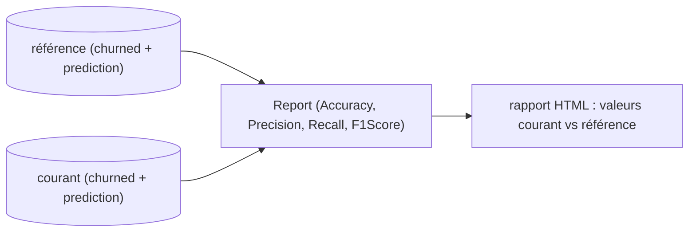
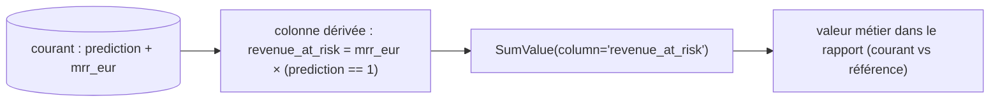
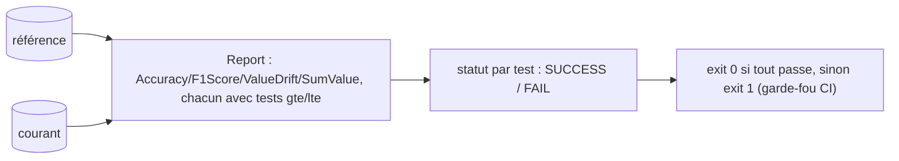
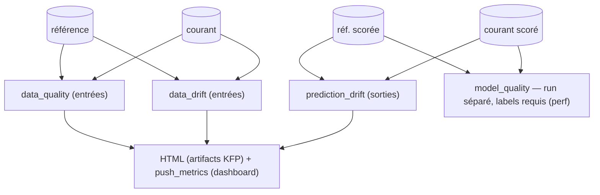

# Introduction — surveiller un modèle en production

Aux modules précédents, on a entraîné un modèle reproductible, on l'a servi, puis orchestré et déployé automatiquement le meilleur. Une fois en production, le travail n'est pas fini : un modèle se dégrade **silencieusement**. Le code ne change pas, aucune erreur n'apparaît dans les logs, mais le monde bouge, les profils clients évoluent, les distributions d'entrée dérivent, et la qualité des prédictions s'érode sans prévenir.

**Observer** un modèle, c'est rendre cette dégradation visible avant qu'elle ne coûte cher.

Concrètement, on surveille quatre choses :

- **Qualité des données** en entrée : valeurs manquantes, types, plages aberrantes.
- **Dérive des données** (*data drift*) : la distribution des features courantes s'éloigne de celle de référence.
- **Dérive des prédictions** (*prediction drift*) : la distribution des sorties change.
- **Qualité du modèle** : performance réelle (accuracy, F1, métrique métier), une fois la vérité terrain connue.

L'outil de ce module est **Evidently** : il compare un jeu **de référence** à un jeu **courant** et produit métriques, tests et rapports sur ces quatre axes. 

On monte progressivement :

1. **Évaluer la qualité** d'un modèle avec des métriques Evidently.
2. **Métrique personnalisée** : une KPI métier (revenu à risque) absent des métriques natives.
3. **Tests** : transformer une métrique en garde-fou Pass/Fail.
4. **Rapport** : tout assembler dans un HTML unique.
5. **Monitoring dans les pipelines** : industrialiser ces checks dans les pipelines KFP.
6. **Dashboard** : suivre les métriques dans le temps, pas seulement à l'instant t.
7. **Dashboard temps réel** : l'alimenter run après run.
8. **Monitoring en ligne** : le remplir au fil du trafic réel du serveur.

> Evidently compare toujours **deux jeux de données** : un jeu de **référence** (souvent l'entraînement ou un batch précédent) et un jeu **courant** (de nouvelles données, ou le jeu de test). Un rapport, une métrique ou un test naissent de cette comparaison.


# 1 - Évaluer la qualité d'un modèle

Evidently fournit des rapports interactifs et détaillés sur les performances d'un modèle. On commence par les **métriques de classification** : on demande explicitement les métriques qui nous intéressent.

*Le principe est simple, on compare deux jeux scorés et on produit un rapport.*



**1. Récupérer deux parquets scorés**

Les exercices comparent un jeu **référence** à un jeu **courant**, tous deux **scorés** : ils contiennent au moins `churned` (vérité terrain), `prediction` (sortie du modèle) et `mrr_eur` (revenu mensuel, utile en partie 2). Ces deux parquets sont publiés sur le dépôt de données VersoML et lus directement depuis là. Pour les régénérer, [`src/scripts/make_scored_datasets.py`](../src/scripts/make_scored_datasets.py) télécharge `churn.parquet` (référence) et `churn_drifted.parquet` (courant) ainsi que le modèle depuis ce dépôt, puis ajoute la colonne `prediction` :

```bash
uv run python src/scripts/make_scored_datasets.py
```

**2. Décrire le schéma et choisir les métriques**

Pour qu'Evidently sache *quelle* colonne est la cible et *laquelle* la prédiction, on décrit le schéma via `DataDefinition` + `BinaryClassification`, puis on construit un `Dataset` :

```python
import pandas as pd
from evidently import BinaryClassification, DataDefinition, Dataset, Report
from evidently.metrics import Accuracy, F1Score, Precision, Recall

schema = DataDefinition(
    categorical_columns=["prediction"],
    classification=[BinaryClassification(target="churned", prediction_labels="prediction")],
)

def as_dataset(df):
    return Dataset.from_pandas(df[["churned", "prediction"]], data_definition=schema)

ref = as_dataset(pd.read_parquet("https://raw.githubusercontent.com/VersoML/mlops-training-data/main/reference_scored.parquet"))
cur = as_dataset(pd.read_parquet("https://raw.githubusercontent.com/VersoML/mlops-training-data/main/current_scored.parquet"))

report = Report([Accuracy(), Precision(), Recall(), F1Score()]).run(cur, ref)
report.save_html("model_quality.html")
```

Pour le jeu standard de métriques de classification sans les lister une à une, un **preset** les regroupe :

```python
from evidently.presets import ClassificationPreset

Report([ClassificationPreset()]).run(cur, ref).save_html("model_quality.html")
```

**3. Générer le rapport**

[`src/observability/report.py`](../src/observability/report.py) fait exactement ça en ligne de commande. On le lance sur les deux parquets de l'étape 1 :

```bash
uv run python src/observability/report.py \
  --reference https://raw.githubusercontent.com/VersoML/mlops-training-data/main/reference_scored.parquet \
  --current https://raw.githubusercontent.com/VersoML/mlops-training-data/main/current_scored.parquet \
  --output model_quality.html
```

Ouvrir `model_quality.html` dans un navigateur pour lire les métriques (courant vs référence).


# 2 - Métrique personnalisée

Les métriques natives (accuracy, F1...) traitent toutes les erreurs de la même façon. Mais en churn, **toutes les erreurs ne coûtent pas pareil** : laisser partir un client Enterprise à 300 €/mois pèse bien plus qu'un compte Free. On veut donc une métrique **métier** qu'Evidently ne fournit pas : le **revenu à risque** = la somme du `mrr_eur` des clients que le modèle prédit comme churners.

*Recette : Evidently n'a pas de métrique « revenu à risque » → on **dérive la colonne** nous-mêmes, puis on l'**agrège** avec une métrique existante (`SumValue`).*



**1. Dériver la colonne métier et l'agréger**

On réutilise les parquets scorés de la partie 1. On ajoute la colonne `revenue_at_risk`, puis on l'agrège avec `SumValue` :

```python
import pandas as pd
from evidently import DataDefinition, Dataset, Report
from evidently.metrics import SumValue

def with_revenue_at_risk(df):
    out = df.copy()
    out["revenue_at_risk"] = out["mrr_eur"] * (out["prediction"] == 1)  # MRR des churners prédits
    return out

schema = DataDefinition(numerical_columns=["revenue_at_risk"])

def as_dataset(df):
    df = with_revenue_at_risk(df)
    return Dataset.from_pandas(df[["revenue_at_risk"]], data_definition=schema)

ref = as_dataset(pd.read_parquet("https://raw.githubusercontent.com/VersoML/mlops-training-data/main/reference_scored.parquet"))
cur = as_dataset(pd.read_parquet("https://raw.githubusercontent.com/VersoML/mlops-training-data/main/current_scored.parquet"))

Report([SumValue(column="revenue_at_risk")]).run(cur, ref).save_html("revenue_at_risk.html")
```

`SumValue` est une métrique « valeur unique » (comme `MeanValue`, `MinValue`, `QuantileValue`...) : elle agrège une colonne numérique en un nombre, comparé entre courant et référence. La métrique perso tient donc en **deux gestes** : *feature engineering* d'une colonne métier + agrégateur existant.

**2. Générer le rapport**

Dans le projet, cette métrique est déjà intégrée à [`src/observability/report.py`](../src/observability/report.py) (`with_revenue_at_risk` + `SumValue`) : le `revenue_at_risk` apparaît donc dans le rapport produit en partie 1, aux côtés des métriques de classification.

```bash
uv run python src/observability/report.py \
  --reference https://raw.githubusercontent.com/VersoML/mlops-training-data/main/reference_scored.parquet \
  --current https://raw.githubusercontent.com/VersoML/mlops-training-data/main/current_scored.parquet \
  --output model_quality.html
```

> **Pour aller plus loin.** Si l'agrégat ne suffit pas (logique de calcul non triviale, plusieurs colonnes en entrée), Evidently permet de définir une *vraie* métrique custom en sous-classant `SingleValueMetric` + `SingleValueCalculation`. C'est plus lourd pour un KPI métier mais bon à savoir, la colonne dérivée + `SumValue` est suffisante et robuste.


# 3 - Tests

Une métrique *décrit*, un **test** *décide*. Evidently permet d'attacher à une métrique une condition (`gte`, `lte`, ...) qui produit un résultat clair : **SUCCESS** ou **FAIL**. C'est ce qui automatise la validation et sert de garde-fou en CI (exit code 0 / 1).

*Un test = une condition sur une métrique, évaluée dans un `Report` (Pass/Fail).*



**1. Attacher une condition à chaque métrique**

On passe les conditions directement à la métrique via `tests=[...]` — y compris à notre métrique perso :

```python
from evidently import Report
from evidently.metrics import Accuracy, F1Score, SumValue, ValueDrift
from evidently.tests import gte, lte

report = Report([
    Accuracy(tests=[gte(0.70)]),
    F1Score(tests=[gte(0.50)]),
    ValueDrift(column="prediction", tests=[lte(0.30)]),
    SumValue(column="revenue_at_risk", tests=[lte(50_000)]),
]).run(cur, ref)
```

**2. Exécuter en garde-fou**

Pour transformer ça en garde-fou, on lit le statut de chaque test et on sort en erreur si l'un échoue. [`src/observability/tests.py`](../src/observability/tests.py) fait exactement cela (`failed_tests()` extrait les tests non-SUCCESS, puis `sys.exit(1 if failed else 0)`) :

```bash
uv run python src/observability/tests.py \
  --reference https://raw.githubusercontent.com/VersoML/mlops-training-data/main/reference_scored.parquet \
  --current https://raw.githubusercontent.com/VersoML/mlops-training-data/main/current_scored.parquet \
  --output model_tests.html
echo "exit code = $?"   # 0 si tout passe, 1 si au moins un test échoue
```

Pour voir le garde-fou se déclencher, gonflez le `mrr_eur` du jeu courant (ou son taux de churn) et relancez : `SumValue(... lte(50_000))` bascule en FAIL et l'exit code passe à 1 — c'est le signal qu'une CI utilise pour **bloquer** une promotion de modèle.

# 4 - Assembler dans un rapport

**1. Réunir presets, métrique métier et tests dans un seul `Report`**

Un `Report` Evidently n'est pas limité à un type d'objet : il accepte dans une **même liste** des presets, des métriques individuelles, notre métrique personnalisée, et des métriques portant des tests. On peut donc tout réunir dans **un seul rapport HTML** :

```python
from evidently import Report
from evidently.metrics import SumValue
from evidently.presets import ClassificationPreset

report = Report([
    ClassificationPreset(),
    SumValue(column="revenue_at_risk"),
]).run(cur, ref)
report.save_html("rapport.html")
```

**2. Générer les deux livrables**

En pratique, on distingue deux usages du rapport, portés par deux scripts du projet :

| Usage | Contenu | Sortie | Fichier projet |
|-------|---------|--------|----------------|
| **Observation** — lire/expliquer la performance | métriques + métrique métier, sans condition | HTML à interpréter | [`report.py`](../src/observability/report.py) |
| **Garde-fou** — décider Pass/Fail en CI | mêmes métriques **avec** `tests=[...]` | HTML + exit code 0/1 | [`tests.py`](../src/observability/tests.py) |

On génère les deux sur les mêmes parquets référence/courant :

```bash
uv run python src/observability/report.py \
  --reference https://raw.githubusercontent.com/VersoML/mlops-training-data/main/reference_scored.parquet --current https://raw.githubusercontent.com/VersoML/mlops-training-data/main/current_scored.parquet \
  --output rapport.html

uv run python src/observability/tests.py \
  --reference https://raw.githubusercontent.com/VersoML/mlops-training-data/main/reference_scored.parquet --current https://raw.githubusercontent.com/VersoML/mlops-training-data/main/current_scored.parquet \
  --output rapport_tests.html
```

Le premier est le **livrable** d'évaluation (qualité globale, revenu à risque courant vs référence). Le second est le **garde-fou** qui protège la mise en production. Ce sont ces deux composants qu'on industrialise généralement dans les pipelines.

# 5 - Monitoring dans les pipelines ML

Lors des pratique sur KFP nous avons développé 2 pipelines, une d'entraînement, une d'inférence. Nous allons intégrer une couche de monitoring à ces pipelines.

La couche de monitoring doit :
- Durant l'ingénierie des données : valider la stabilité et la qualité des données d'entrées.
- Durant l'entraînement : valider la qualité du modèle.
- Durant l'inférence : valider les données d'entrées ET de sorties.
- Durant le monitoring de la performance : Monitorer la qualité du modèle.

Note: KFP propose une sortie des ses composants sous forme HTML. Cette sortie sera ensuite disponible sur l'application (Kubeflow Plateform ou Vertex AI).

*Couche de monitoring à ce stade (drift entrées/sorties dans l'inférence, qualité modèle à part) :*



### Les 4 préoccupations → 4 composants Evidently

Chaque préoccupation ci-dessus se traduit par un `@dsl.component` qui sauvegarde un `Report` Evidently en HTML (`Output[HTML]`), en comparant un jeu **référence** à un jeu **courant** :

| Étape de la couche de monitoring | Composant(s) | Preset / métrique Evidently |
|----------------------------------|--------------|------------------------------|
| Ingénierie des données — qualité + stabilité des inputs | `data_quality`, `data_drift` | `DataSummaryPreset`, `DataDriftPreset` |
| Entraînement — qualité du modèle | `model_quality` | `ClassificationPreset` |
| Inférence — inputs **et** outputs | `data_quality` / `data_drift` (inputs) + `prediction_drift` (outputs) | `ValueDrift(column="prediction")` |
| Monitoring de la performance — qualité du modèle | `model_quality` | `ClassificationPreset` |

### Les composants (`src/orchestration/components/monitoring.py`)


**Qualité & dérive des données** (inputs). On déclare le schéma (colonnes numériques / catégorielles) puis on lance le `Report` :

```python
@dsl.component(base_image="python:3.12-slim", packages_to_install=EVIDENTLY_DEPS)
def data_quality(reference: Input[Dataset], current: Input[Dataset], report: Output[HTML]) -> None:
    import pandas as pd
    from evidently import DataDefinition, Dataset, Report
    from evidently.presets import DataSummaryPreset

    schema = DataDefinition(
        numerical_columns=["tenure_days", "nb_logins_30j", "nb_features_used", "support_tickets_90j", "mrr_eur"],
        categorical_columns=["plan", "has_integration"],
    )
    ref = Dataset.from_pandas(pd.read_parquet(reference.path), data_definition=schema)
    cur = Dataset.from_pandas(pd.read_parquet(current.path), data_definition=schema)
    Report([DataSummaryPreset()]).run(cur, ref).save_html(report.path)
```

`data_drift` est identique, avec `DataDriftPreset()` à la place de `DataSummaryPreset()`.

**Dérive des prédictions** (outputs) : on ne garde que la colonne `prediction` :

```python
@dsl.component(base_image="python:3.12-slim", packages_to_install=EVIDENTLY_DEPS)
def prediction_drift(reference_scored: Input[Dataset], current_scored: Input[Dataset], report: Output[HTML]) -> None:
    import pandas as pd
    from evidently import DataDefinition, Dataset, Report
    from evidently.metrics import ValueDrift

    schema = DataDefinition(categorical_columns=["prediction"])
    ref = Dataset.from_pandas(pd.read_parquet(reference_scored.path)[["prediction"]], data_definition=schema)
    cur = Dataset.from_pandas(pd.read_parquet(current_scored.path)[["prediction"]], data_definition=schema)
    Report([ValueDrift(column="prediction")]).run(cur, ref).save_html(report.path)
```

**Qualité du modèle** — nécessite les labels `churned` **et** les prédictions :

```python
@dsl.component(base_image="python:3.12-slim", packages_to_install=EVIDENTLY_DEPS)
def model_quality(reference_scored: Input[Dataset], current_scored: Input[Dataset], report: Output[HTML]) -> None:
    import pandas as pd
    from evidently import BinaryClassification, DataDefinition, Dataset, Report
    from evidently.presets import ClassificationPreset

    schema = DataDefinition(
        categorical_columns=["prediction"],
        classification=[BinaryClassification(target="churned", prediction_labels="prediction")],
    )
    cols = ["churned", "prediction"]
    ref = Dataset.from_pandas(pd.read_parquet(reference_scored.path)[cols], data_definition=schema)
    cur = Dataset.from_pandas(pd.read_parquet(current_scored.path)[cols], data_definition=schema)
    Report([ClassificationPreset()]).run(cur, ref).save_html(report.path)
```

### Greffer le monitoring dans la pipeline d'inférence

Plutôt qu'une pipeline de monitoring isolée, on **greffe** ces checks dans la pipeline d'inférence (`src/orchestration/pipelines/inference.py`). Une seule passe charge le **courant** + une **référence** (typiquement le jeu d'entraînement), produit la prédiction métier (`batch_predict`), émet les rapports de qualité/dérive des **entrées**, dérive des **sorties** :

```python
@dsl.pipeline(name="churn-inference",
              description="Batch scoring + monitoring (data quality/drift on inputs, drift on outputs)")
def inference_pipeline(source_url: str, reference_url: str, mlflow_tracking_uri: str,
                       model_uri: str = "models:/churn-model@champion") -> None:
    cur = load_data(source_url=source_url).set_display_name("Load current")
    ref = load_data(source_url=reference_url).set_display_name("Load reference")

    # Inférence : la sortie métier (prediction + churn_probability)
    preds = batch_predict(dataset=cur.outputs["dataset"], mlflow_tracking_uri=mlflow_tracking_uri, model_uri=model_uri)

    # Monitoring des entrées : qualité + dérive des features
    data_quality(reference=ref.outputs["dataset"], current=cur.outputs["dataset"])
    data_drift(reference=ref.outputs["dataset"], current=cur.outputs["dataset"])

    # Monitoring des sorties : dérive des prédictions (la référence est scorée pour comparaison)
    ref_scored = add_predictions(dataset=ref.outputs["dataset"], mlflow_tracking_uri=mlflow_tracking_uri, model_uri=model_uri)
    prediction_drift(reference_scored=ref_scored.outputs["scored"],
                     current_scored=preds.outputs["predictions"])
```

```bash
uv run python src/orchestration/pipelines/inference.py
```

`batch_predict` produit la sortie d'inférence riche (prédiction + probabilité) : la référence n'est scorée (`add_predictions`) que pour comparer la distribution des prédictions. Chaque composant de monitoring émet un rapport HTML, visible comme artifact du run.

> `model_quality` n'est **pas** dans cette pipeline : il faut les labels réels (`churned`), qui arrivent en différé. C'est l'étape **« monitoring de la performance »** : un run séparé (`src/orchestration/pipelines/monitoring.py`) qui compare `churned` vs `prediction` une fois les vérités terrain disponibles.


# 6 - Dashboard

Les rapports HTML des parties 1 à 5 sont des **photos à l'instant t** : utiles pour un batch donné, mais un modèle en production se surveille **dans la durée**. Une dérive lente, une performance qui s'effrite run après run, ça ne se voit pas sur un rapport isolé — il faut suivre la **tendance** sur de nombreux runs. Evidently fournit pour ça un **service UI** qui stocke les runs et trace des **dashboards**.

Cette partie **définit** le dashboard (sa structure : quels graphiques, quelles métriques) ; la partie suivante le **remplit** en y poussant des runs. Trois niveaux à distinguer :

- un **workspace** = le service Evidently UI, joint via `RemoteWorkspace(url)`.
- un **projet** dans ce workspace = un fil de **runs** (snapshots) accumulés au fil du temps.
- un **dashboard** = des **panels**, chaque panel traçant **une métrique** (par son nom + ses labels) sur l'ensemble des runs du projet.


**Définir le dashboard.** [`src/scripts/setup_project.py`](../src/scripts/setup_project.py) déclare les panels (un par graphique) et rattache chacun à une métrique :

```python
from evidently.sdk.panels import PanelMetric, counter_panel, line_plot_panel

panels = [
    counter_panel(
        title="Drifted columns (latest run)",
        values=[PanelMetric(metric="DriftedColumnsCount", legend="count")],
        aggregation="last",
    ),
    line_plot_panel(
        title="Prediction drift score",
        values=[PanelMetric(metric="ValueDrift", metric_labels={"column": "prediction"})],
    ),
    line_plot_panel(
        title="Mean MRR over time",
        values=[PanelMetric(metric="MeanValue", metric_labels={"column": "mrr_eur"})],
    ),
    # ... + "Drifted columns share over time"
]
```

Puis il se connecte au workspace, crée (ou retrouve) le projet, et sauve le dashboard :

```python
from evidently.ui.workspace import RemoteWorkspace

ws = RemoteWorkspace(workspace_url, secret=secret)
project = ws.create_project("churn-monitoring")   # ou ws.search_project(name) si déjà créé
ws.save_dashboard(project.id, build_dashboard())
print(f"export EVIDENTLY_PROJECT_ID={project.id}")
```

**Mise en place.** Il faut d'abord un service Evidently UI joignable, puis créer le projet :

```bash

uv run evidently ui --host 0.0.0.0 --port 8000
```

Dans un autre terminal :

```bash
export EVIDENTLY_WORKSPACE_URL=<YOUR_EVIDENTLY_URL>
uv run python src/scripts/setup_project.py
#   -> Created project 'churn-monitoring' with id <UUID>
#   -> export EVIDENTLY_PROJECT_ID=<UUID>
```


# 7 - Realtime Monitoring Dashboard
Le dashboard de la partie 6 a une structure (des panels), mais il est **vide** : on a défini *quoi* afficher, pas encore *avec quelles données*. Cette partie le branche sur la réalité : chaque batch traité y dépose un point, et la courbe se construit run après run.

Le mécanisme est direct : à chaque run, on calcule un `Report` contenant **exactement les métriques attendues par les panels** (mêmes noms, mêmes labels), puis on le **pousse** dans le projet via `ws.add_run(...)`. En enchaînant ces pushes batch après batch, on passe d'une surveillance ponctuelle à un suivi continu. C'est le rôle du composant `push_metrics` ([`src/orchestration/components/monitoring.py`](../src/orchestration/components/monitoring.py)) :

```python
from evidently import Report
from evidently.metrics import DriftedColumnsCount, MeanValue, ValueDrift
from evidently.ui.workspace import RemoteWorkspace

snapshot = Report([
    DriftedColumnsCount(),
    ValueDrift(column="prediction"),
    MeanValue(column="mrr_eur"),
]).run(cur, ref)

ws = RemoteWorkspace(workspace_url, secret=secret or None)
ws.add_run(project_id, snapshot, include_data=False)
```

`push_metrics` est câblé en **dernier step de la pipeline d'inférence** : chaque batch d'inférence pousse un snapshot frais, et le dashboard se met à jour run après run (near-realtime). Sans `workspace_url` / `project_id`, le composant ne fait rien — l'inférence tourne sans dashboard.

Avant de lancer la pipeline, exporter la cible :

```bash
export EVIDENTLY_WORKSPACE_URL=http://localhost:8000
export EVIDENTLY_PROJECT_ID=<UUID renvoyé par setup_project.py>
export EVIDENTLY_SECRET=...        # optionnel
```

**Bout-en-bout :**

1. lancer le service Evidently UI (`uv run evidently ui`) ;
2. `setup_project.py` -> crée le projet + le dashboard, renvoie `EVIDENTLY_PROJECT_ID` ;
3. exporter les `EVIDENTLY_*` ;
4. lancer (ou planifier) la pipeline d'inférence -> `push_metrics` alimente le dashboard à chaque run ;
5. ouvrir l'UI -> suivre la dérive des colonnes, la dérive des prédictions et le MRR moyen évoluer dans le temps.

# 8 - Monitoring en ligne : dashboard live alimenté par le serveur

La partie 7 pousse un snapshot **par run de pipeline** (batch). Mais en production le modèle est servi *en continu* par l'API (module 2) : on veut que le dashboard se remplisse **au fil du trafic réel**, pas seulement quand une pipeline tourne. C'est le *online monitoring*.

Le motif reste le même qu'en partie 7 : calculer un `Report` et le pousser via `add_run` mais il est désormais déclenché par le trafic du serveur au lieu d'une pipeline.

**1. Le serveur capture le trafic.** À chaque `/predict`, [`server.py`](../src/serving/server.py) empile `features + prediction` dans [`CaptureBuffer`](../src/observability/capture.py), qui se vide par paquets de `CAPTURE_FLUSH_SIZE` lignes dans `CAPTURE_DIR/YYYY-MM-DD/HH-<uuid>.parquet`. Chaque parquet vidé est un **micro-batch** de trafic réel.

```python
from observability.capture import buffer_from_env

@asynccontextmanager
async def lifespan(app: FastAPI):
    state["model"] = mlflow.pyfunc.load_model(MODEL_URI)
    state["capture"] = buffer_from_env()   # lit CAPTURE_DIR, CAPTURE_FLUSH_SIZE
    yield
    state["capture"].flush()               # vide le reste à l'arrêt

@app.post("/predict", response_model=Prediction)
def predict(features: ChurnFeatures) -> Prediction:
    payload = features.model_dump()
    prediction = bool(state["model"].predict(pd.DataFrame([payload]))[0])
    state["capture"].append({**payload, "prediction": prediction})  # features + sortie
    return Prediction(churned=prediction)
```

**2. La boucle pousse un snapshot par micro-batch.** [`src/observability/online_monitor.py`](../src/observability/online_monitor.py) **surveille** `CAPTURE_DIR`, et pour chaque nouveau micro-batch calcule un `Report` (les mêmes métriques que les panels de la partie 6) comparé à la référence, puis le pousse via `add_run` :

```python
seen = set()
while True:
    for path in sorted(glob.glob(f"{capture_dir}/**/*.parquet", recursive=True)):
        if path in seen:
            continue
        seen.add(path)
        batch = pd.read_parquet(path)
        batch["prediction"] = batch["prediction"].astype(int)
        current = Dataset.from_pandas(batch[COLS], data_definition=SCHEMA)
        snapshot = Report([
            DriftedColumnsCount(),
            ValueDrift(column="prediction"),
            MeanValue(column="mrr_eur"),
        ]).run(current, reference)
        ws.add_run(project_id, snapshot, include_data=False, name=os.path.basename(path))
    time.sleep(poll_interval)
```

> **`churned` n'est pas là.** À l'instant de la prédiction on connaît les features et la sortie mais pas la vérité terrain. Le dashboard live suit donc la dérive des **entrées** (`DriftedColumnsCount`), des **sorties** (`ValueDrift(prediction)`) et le **MRR moyen**, mais **pas** `model_quality` : celui-ci exige les `churned` réels, qui arrivent en différé (passe séparée, partie 5).

**Bout-en-bout (4 terminaux).**

```bash
# 1. service UI Evidently
uv run evidently ui --host 0.0.0.0 --port 8000

# 2. créer le projet + le dashboard (renvoie EVIDENTLY_PROJECT_ID)
export EVIDENTLY_WORKSPACE_URL=http://localhost:8000
uv run python src/scripts/setup_project.py

# 3. serveur d'inférence live, qui capture le trafic
export MODEL_URI=models:/churn-model@champion CAPTURE_DIR=/tmp/predictions_log CAPTURE_FLUSH_SIZE=50
uv run uvicorn src.serving.server:app --port 8001

# 4. la boucle de monitoring en ligne -> alimente le dashboard
export EVIDENTLY_WORKSPACE_URL=http://localhost:8000 EVIDENTLY_PROJECT_ID=<UUID> CAPTURE_DIR=/tmp/predictions_log
uv run python src/observability/online_monitor.py
```

Reste à envoyer du trafic. Un petit générateur tire des lignes (avec une légère dérive) et les poste sur `/predict` :

```python
import json
import requests
from utils.generate_churn_dataset import generate

rows = generate(n=500, seed=7).drop(columns=["churned"])
rows["nb_logins_30j"] = (rows["nb_logins_30j"] * 0.7).round().astype(int)  # dérive
for row in json.loads(rows.to_json(orient="records")):
    requests.post("http://localhost:8001/predict", json=row)
```

Lancez les 4 services, envoyez le trafic ci-dessus, puis ouvrez l'UI : chaque paquet de `CAPTURE_FLUSH_SIZE` prédictions fait apparaître un nouveau point sur les panels (dérive des colonnes, dérive de `prediction`, MRR moyen). Le dashboard se remplit **en direct**, au rythme du trafic et non d'une pipeline batch. La chaîne **servir → capturer → surveiller en ligne** est bouclée.
